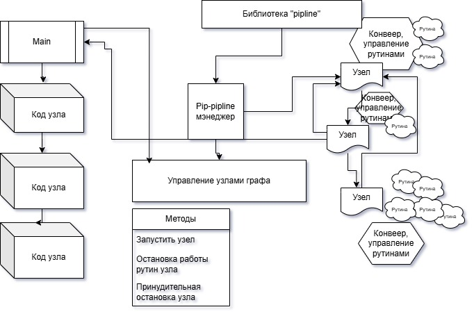

## Задание Go: Библиотека потоковой обработки данных

### Описание
Программа с библиотекой для конструирования пайплайна потоковой обработки данных на языке Go.
Библиотека позволяет создавать пайплайны в виде направленного графа, где узлами являются элементарные операции (ноды) обработки данных.

#### Пример работы библиотеки будет вычисление MD5-хешей файлов в директории:
● Рекурсивно обойти заданную директорию  
● Для каждого найденного файла вычислить MD5-хеш  
● Операция вычисления MD5 должна быть параллелизирована  
● Должна быть возможность задать степень параллелизма (по умолчанию: 10)

### Структура проекта
Схема диаграмма ***Pipline conveer***


#### Дополнительно
В коде есть закомментированный пример эмуляции вызова ошибки (строка 135, раскомментировать, заменить "_"->"i")

### Запуск:
Запустите программу, указав путь к директории для сканирования: 
```sh
go run main.go /path/to/your/directory
go run main.go /path/to/your/directory /path/to/your/directory2 4
```